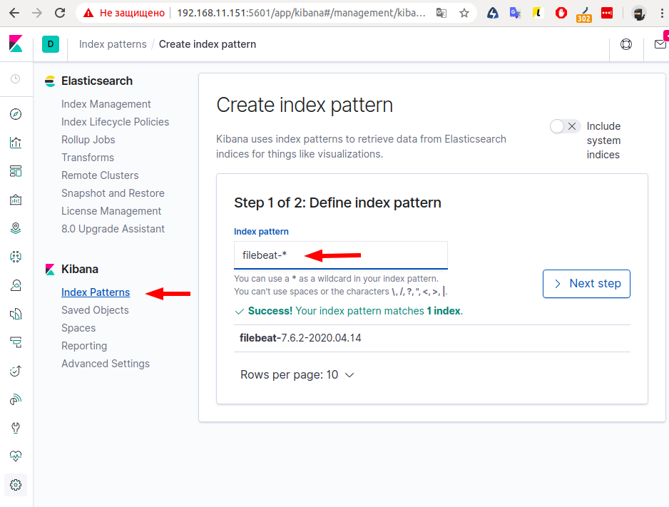
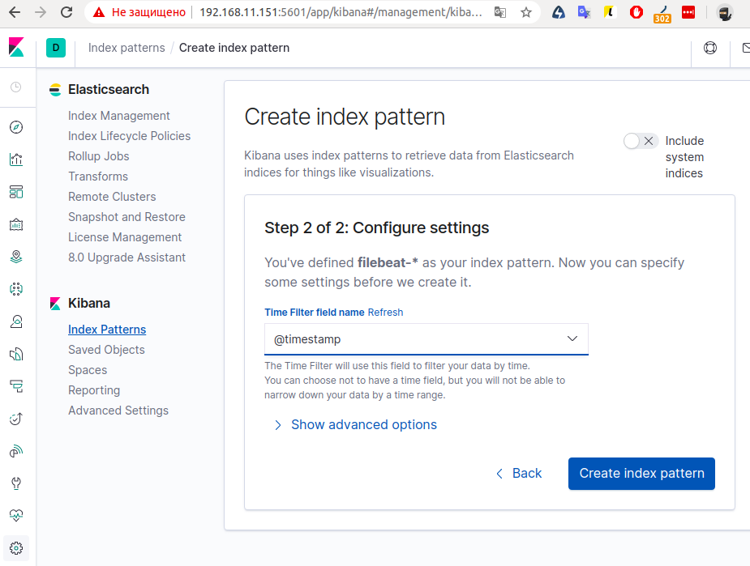
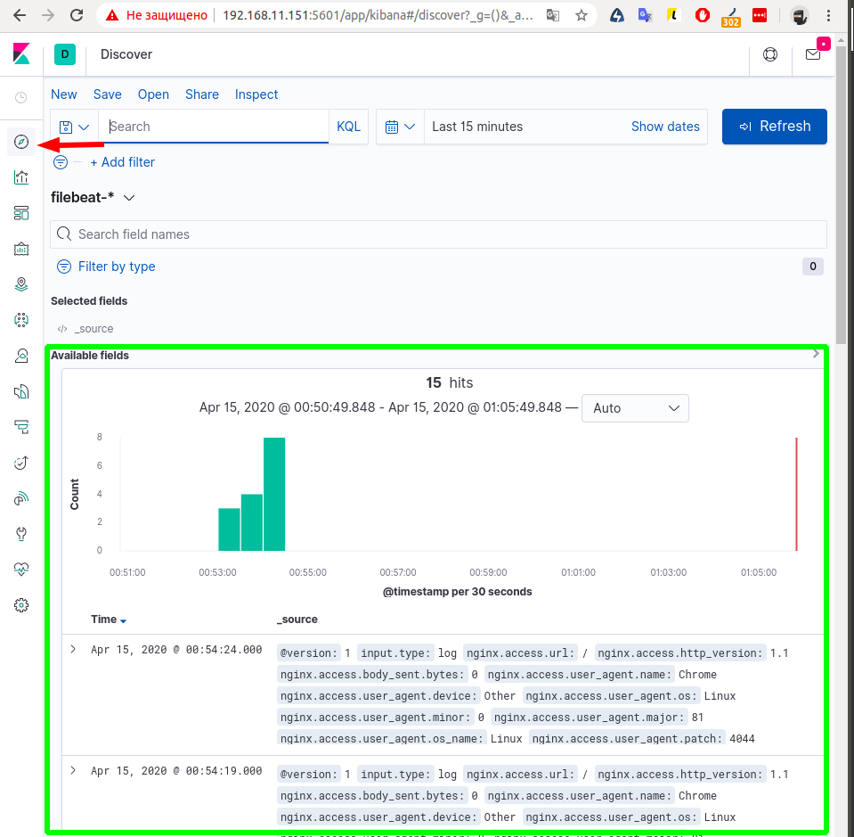

## Настраиваем центральный сервер сбора логов

Подымаем тестовый стенд, запускаются две машины web, log
```
vagrant up
```
Запускаем playbook
```
ansible-playbook elk.yml
```
Преходим по адресу http://192.168.11.150:8080/ для генерации логов 

Kibana http://192.168.11.151:5601/

Добавляем паттерн
```
filebeat-*
```



Смотрим логи

