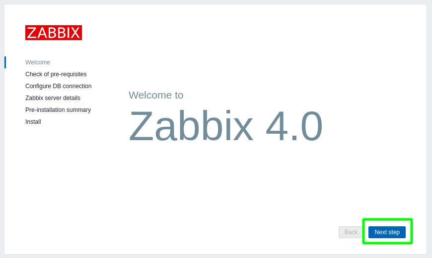
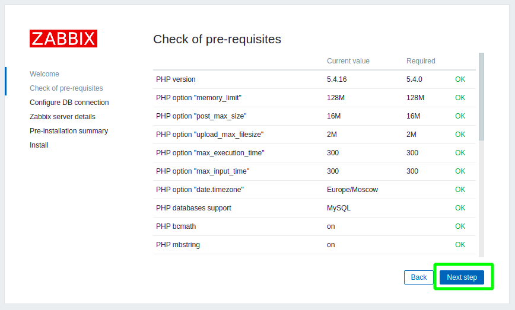
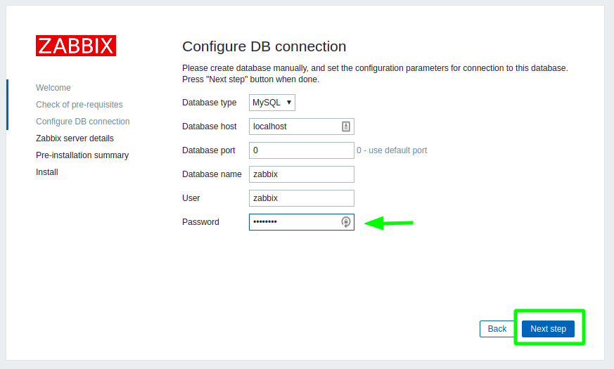
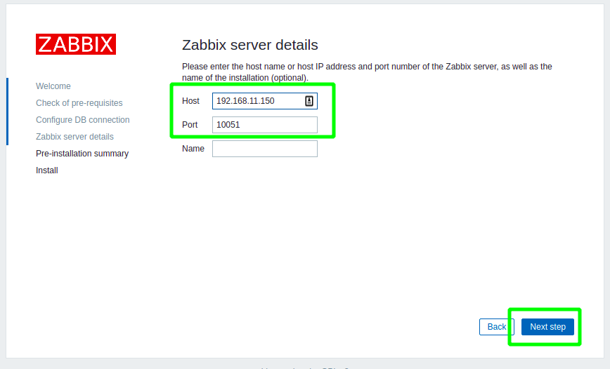
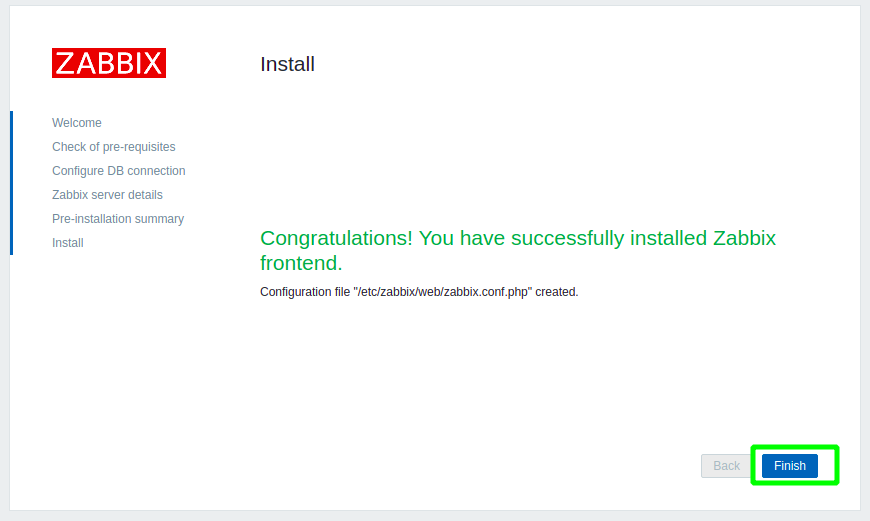
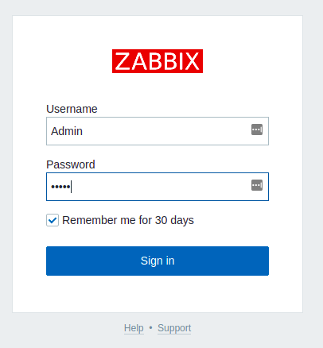
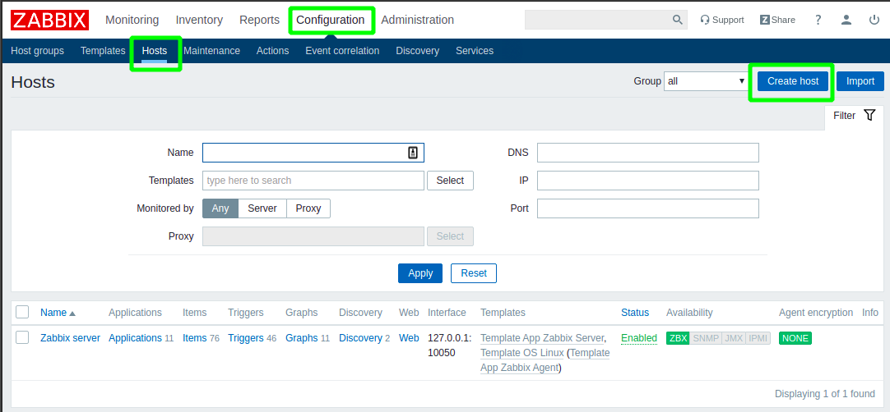
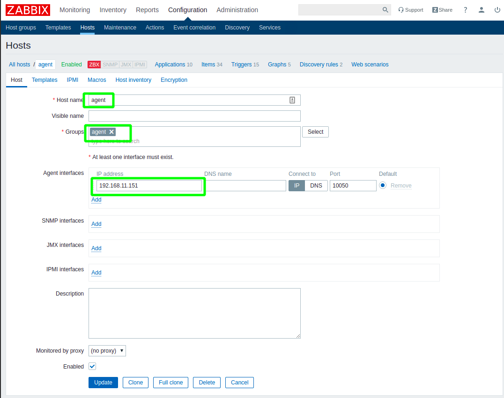
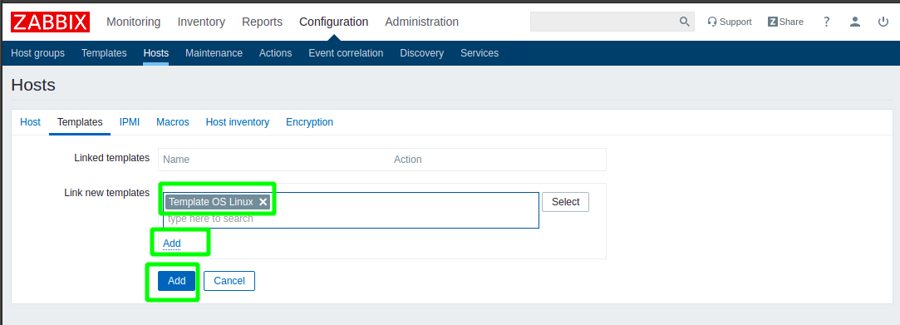
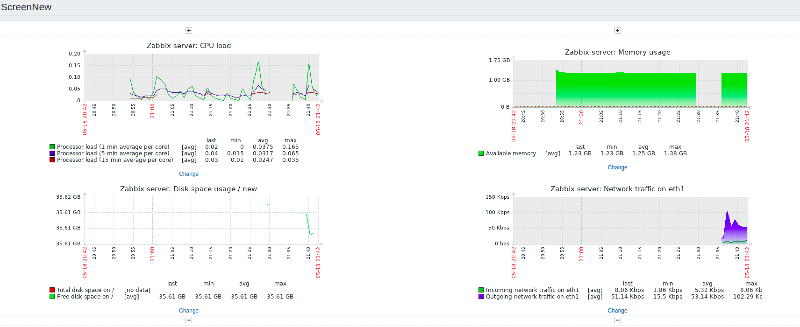

## Настройка мониторинга zabbix

Подымаем тестовый стенд, запускаются две машины server, agent
```
vagrant up
```
Запускаем playbook
```
ansible-playbook zabbix.yml
```
Заходим на сервер 
```
vagrant ssh server
sudo su
```
Заходим в mysql и создаем БД и поьльзователя (на проде, естественно не будем использовать дефолный пароль)
```
# mysql
mysql> create database zabbix character set utf8 collate utf8_bin;
GRANT ALL PRIVILEGES ON zabbix.* TO zabbix@localhost IDENTIFIED BY 'password'
mysql> create user zabbix@localhost identified by 'password';
mysql> grant all privileges on zabbix.* to zabbix@localhost;
mysql> FLUSH PRIVILEGES;
mysql> quit;
```
На хосте Заббикс сервера импортируйте начальную схему и данные
```
# zcat /usr/share/doc/zabbix-server-mysql*/create.sql.gz | mysql zabbix
```

Переходим в веб интерфейс zabbix
```
http://192.168.11.150/zabbix
```


Zabbix проверяет конфигурацию системы



Заполняем поля Database name: zabbix, User: zabbix, Password: password





Входим в веб интерфейс zabbix
Username: Admin
Password: zabbix





