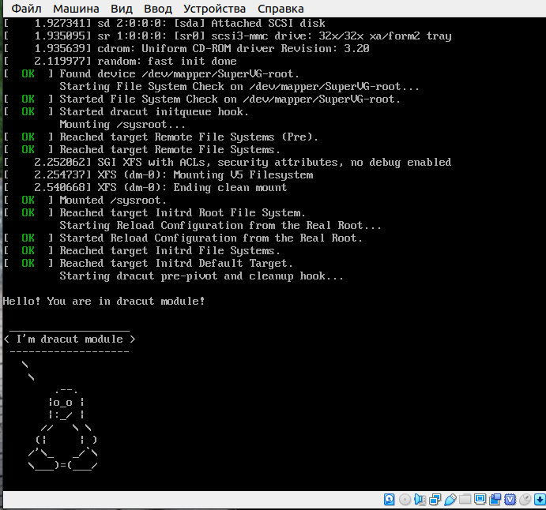

## 1. Попасть в систему без пароля несколькими способами

### При загрузке системы нажимаем "e"


### Все изменения производим со сторокой начинающей с "linux16"


### Способ 1

Добавляем в конец строки **init=/bin/sh** и нажимаем **Ctrl+x** для загрузки системы.

Система монтируется в режиме **чтения**, перемонтируем ее в режим **чтения/запись**.
```
# mount -o remount,rw /
```
Проверяем
```
# mount | grep root
```

### Способ 2

В конце строки добавляем **rd.break** и нажимаем **Ctrl+x**.

Теперь можно выполнять команды в консоле.

```
# mount -o remount,rw /sysroot
# chroot /sysroot
# passwd root
# touch /.autorelabel
```

### Способ 3

В строке заменяем **ro** на **rw**, в конец добавляем **init=/sysroot/bin/sh** и нажимаем **Ctrl+x**. Система монтируется сражу в режиме **чтения/записи**.

## 2. Установить систему с LVM, после чего переименовать VG

Смотрим имя VG.
```
[root@localhost ~]# vgs
  VG     #PV #LV #SN Attr   VSize   VFree
  TestVG   1   1   0 wz--n-   6,19g    0 
  centos   1   1   0 wz--n- 820,00m    0
```
Переименовываем
```
[root@localhost ~]# vgrename TestVG SuperVG
  Volume group "centos" successfully renamed to "SuperVG"

```
Проверяем изменения 
```
[root@localhost ~]# vgs
  VG      #PV #LV #SN Attr   VSize   VFree
  SuperVG   1   1   0 wz--n-   6,19g    0 
  centos    1   1   0 wz--n- 820,00m    0
```
Заменāем старое название на новое в файлах **/etc/fstab, /etc/default/grub, /boot/grub2/grub.cfg**.

Пересоздаем initrd image, чтобы он знал новое название Volume Group
```
[root@localhost ~]# mkinitrd -f -v /boot/initramfs-$(uname -r).img $(uname -r)
```
Перезагружаем машину и проверяем
```
[root@localhost ~]# vgs
  VG      #PV #LV #SN Attr   VSize   VFree
  SuperVG   1   1   0 wz--n-   6,19g    0 
  centos    1   1   0 wz--n- 820,00m    0
```
## 3. Добавить модуль в initrd

Скрипты модулей хранятся в каталоге **/usr/lib/dracut/modules.d/**. Для того чтобы
добавить свой модуль создаем там папку с именем **01test**:

```
[root@localhost ~]# mkdir /usr/lib/dracut/modules.d/01test
```
В нее поместим два скрипта:

```bash
# module-setup.sh

#!/bin/bash

check() {
    return 0
}

depends() {
    return 0
}

install() {
    inst_hook cleanup 00 "${moddir}/test.sh"
}
```
```bash
# test.sh

#!/bin/bash

exec 0<>/dev/console 1<>/dev/console 2<>/dev/console
cat <<'msgend'

Hello! You are in dracut module!

 ___________________
< I'm dracut module >
 -------------------
   \
    \
        .--.
       |o_o |
       |:_/ |
      //   \ \
     (|     | )
    /'\_   _/`\
    \___)=(___/
msgend
sleep 10
echo " continuing...."
```

Пересобираем образ **initrd**
```
[root@localhost ~]# mkinitrd -f -v /boot/initramfs-$(uname -r).img $(uname -r)
# Или
[root@localhost ~]# dracut -f -v
```

Проверяем и смотрим какие модули загружены в образ:
```
[root@localhost ~]# lsinitrd -m /boot/initramfs-$(uname -r).img | grep test
test
```
После чего можно пойти двумя путями для проверки:

1. Перезагрузиться и руками выключить опции **rhgb** и **quiet** и увидеть вывод.
2. Либо отредактировать **grub.cfg** убрав эти опции.

